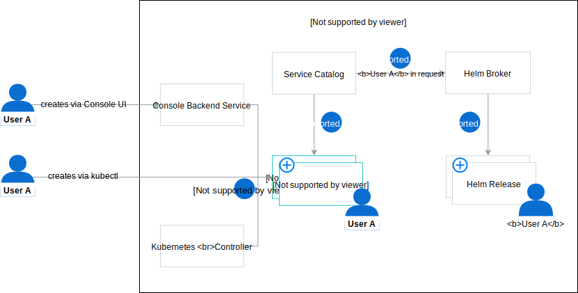
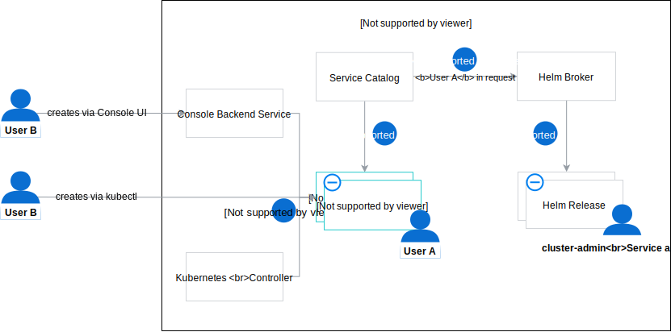

# How to install addons in a secure way 

Created on 2020-06-15 by Mateusz Szostok ([@mszostok](https://github.com/mszostok)).

This document describes how Helm Broker can install Helm charts using the same privileges as the user who created a ServiceInstance.

## Motivation

Helm was using Tiller to maintain the state of a Helm release. To do so, Tiller required a "God mode" which means that it needed to have admin role-based access controls (RBAC). For security reasons, [Tiller was removed in Helm 3](https://helm.sh/docs/faq/#removal-of-tiller) and now the maintenance of Helm releases is based on the user RBAC.

## Goal

User/ServiceAccount RBAC is used for provisioning a given [addon](https://github.com/kyma-project/addons) through Service Catalog. If a given tenant doesn't have the resource permission, the provisioning fails and a proper error appears.
  
## Suggested solution

Service Catalog has the [OriginatingIdentity](https://github.com/kubernetes-sigs/service-catalog/blob/b6afbc9fec94e7b0d350f22e736d0484d181b351/pkg/features/features.go#L31-L37) feature enabled, which sets up the [UserInfo](https://github.com/kubernetes-sigs/service-catalog/blob/5068f67d9616bab9e21dae8a161578a034a0803a/pkg/apis/servicecatalog/v1beta1/types.go#L748-L754) field. This field is available for both ServiceInstances and ServiceBindings. It contains information about the user that last changed a given resource's **spec** entry. See the example:

```yaml
- apiVersion: servicecatalog.k8s.io/v1beta1
  kind: ServiceInstance
  metadata:
    name: redis
    namespace: impersonate-helm-broker
  spec:
    # ...
    userInfo:
      extra:
        user-assertion.cloud.google.com:
        - AK8TC8KFMXbRT79OYNitihN7n/Hu5WPJCl/R4Csa+q5Pps2PURkphBC+nfYhQ6//1Tk2GCz4rfLTSlLuav8gDTdwq/mWjpjUVrtTA4vhcuxJyPfo27VUkCFhYZ94X7UBgp35TdtPI+SPX8POwWM0JnJzR29wQ7aKdNitWnuS6GAkNxxHeKc6MWzuqppfs526DyfV6w+bEbwbnqDoAO0VuRfhEOUL1eOqpgCW01SF5qf8
      groups:
      - system:authenticated
      uid: ""
      username: mateusz.szostok@sap.com
```

On the other hand, the Kubernetes client has a [user impersonation](https://kubernetes.io/docs/reference/access-authn-authz/authentication/#user-impersonation) feature which we can leverage during the Helm chart installation.

### Architecture 

This section describes architecture both for the install and uninstall action as they differ from each other in the current solution.

> **NOTE:** In the first phase, the support for binding is out of scope, but the Service Catalog enables that flow too.

#### Installation

The new installation workflow consists of the following steps:

1. The user creates a ServiceInstance for a given addon using Console UI, kubectl, or the Kubernetes controller (technical user).
2. Service Catalog detects the newly created ServiceInstance. 
3. Service Catalog sends the provisioning request to Helm Broker. The **UserInfo** field is included in the provisioning HTTP header. 
4. Helm Broker extracts the **UserInfo** from the header and creates a Helm client with **ImpersonateUser** set to the `username` from the request. 

<p align="center">
 
</p>

> **NOTE:** This solution works for both User and ServiceAccount. Kubernetes client should be configured in such a way: 
> - for User, the **{USERNAME}** should be used
> - for ServiceAccount, the **system:serviceaccount:{NAMESPACE}:{SERVICEACCOUNT}** should be used
>
> Naming is already handled by the Service Catalog webhook and **userInfo.username** contains a proper value.

#### Uninstallation

The new uninstallation workflow consists of the following steps:

1. The user deletes a ServiceInstance using Console UI, kubectl, or the Kubernetes controller (technical user).
2. Service Catalog uses the identity of the last user that created or modified the instance.
3. Service Catalog sends the deprovisioning request to Helm Broker with the info on the last user that created or modified the instance specified in the header.
4. Helm Broker ignores the user's identity and uses the **cluster-admin** ServiceAccount which has admin permissions to delete a release from the cluster.

<p align="center">
 
</p>

## Proof of Concept

The PoC was created in the [`impersonate-helm-broker`](https://github.com/mszostok/impersonate-helm-broker) repository.

Follow these steps to validate the proposed workflow: 

1. Create a Kyma cluster.
2. Update the Service Catalog webhook deployment. Run:
    ```bash
   kubectl set image deployment/service-catalog-catalog-webhook svr=mszostok/service-catalog-amd64:fixed-userinfo
    ```
3. Check out the [`impersonate-helm-broker`](https://github.com/mszostok/impersonate-helm-broker) repository locally.
4. Install the `impersonate-helm-broker`. Run:
    ```bash
    kubectl create -f ./deploy
    ```
5. Create a ServiceInstance as the admin who has all privileges. Run: 
    ```bash
   kubectl create -f ./example/si_admin.yaml --as=admin@kyma.cx
    ```
6. Check the status of the created ServiceInstance. Run:
    ```bash
    kubectl get serviceinstance redis-admin
    ```   
   The ServiceInstance should be in the **Ready** state. See the example of an output:
   ```bash
   NAME             CLASS                       PLAN      STATUS   AGE
   redis-admin      ClusterServiceClass/redis   default   Ready    10s
   ```

7. Create a ServiceInstance as **user2** that doesn't have permission for creating Kubernetes resources other than ServiceInstances. Run: 
    ```bash
   kubectl create -f ./example/si_user2.yaml --as=user2@kyma.cx
    ```
8. Check the status of the created ServiceInstance. Run:
    ```bash
    kubectl get serviceinstance redis-user2
    ```   
   The ServiceInstance should be in the **OrphanMitigationSuccessful** state. See the example of an output:
   ```bash
   NAME          CLASS                       PLAN      STATUS                       AGE
   redis-user2   ClusterServiceClass/redis   default   OrphanMitigationSuccessful   13m
   ```

   You can check the Service Catalog controller logs to find the provisioning error. To do so, run:
   ```bash
    kubectl logs $(kubectl get po -n kyma-system -l app=service-catalog-catalog-controller-manager --no-headers -ocustom-columns=name:.metadata.name) -n kyma-system -c controller-manager | grep "Error syncing ServiceInstance impersonate-helm-broker/redis-user2"
    ```
   This is the expected output: 
   ```bash
    I0615 19:07:13.243344       1 controller.go:404] Error syncing ServiceInstance impersonate-helm-broker/redis-user2 (retry: 0/15): Error provisioning ServiceInstance of ClusterServiceClass (K8S: "123-123-123-123-123-123" ExternalName: "redis") at ClusterServiceBroker "impersonate-helm-broker": Status: 500; ErrorMessage: <nil>; Description: namespaces is forbidden: User "user2@kyma.cx" cannot create resource "namespaces" in API group "" at the cluster scope; ResponseError: <nil>
   ```

### Follow-ups

These are the follow-ups that must be executed if we proceed with this solution:

1. The **userInfo** field is always updated with the Service Catalog controller ServiceAccount. 
   
   Accepted solution: [This PR](https://github.com/kubernetes-sigs/service-catalog/pull/2822) must be merged to fix the user's identity feature. Check the PR for more details.

2. Console Backend Service creates a ServiceInstance and ServiceBindings using controller ServiceAccount instead of a user account that triggered that call. 
   
   Accepted solution: A PR is needed to Console Backend Service to add the [user impersonation](https://kubernetes.io/docs/reference/access-authn-authz/authentication/#user-impersonation) feature in the client-go calls.

3. The **userInfo** cannot be updated during the DELETE action. As a result, Helm Broker receives the identity of the last user that executed CREATE or UPDATE action on the ServiceInstance.
   
   Accepted solution: A PR is needed to Helm Broker to use the admin ServiceAccount for Helm releases removal.

   Rejected solution: Move the field from **.spec.userInfo** to **.status.userInfo**. This solution is more clear but more time-consuming and requires changes in the Service Catalog repository.

4. Helm Broker lacks functionality for using User/ServiceAccount RBAC for provisioning a given [addon](https://github.com/kyma-project/addons).

    Accepted solution: Implement logic from the [`impersonate-helm-broker`](https://github.com/mszostok/impersonate-helm-broker) PoC component in Helm Broker:
       
     - [Originating identity middleware](https://github.com/mszostok/impersonate-helm-broker/blob/master/internal/middleware/identity.go).
     - [User impersonation in Helm commands](https://github.com/mszostok/impersonate-helm-broker/blob/3d7f4300250a882e5c98fe174dc5fa38bcae536e/internal/helm/install.go#L76-L77).
     - Update Helm Broker documentation with information from the **Architecture** section from this proposal.
